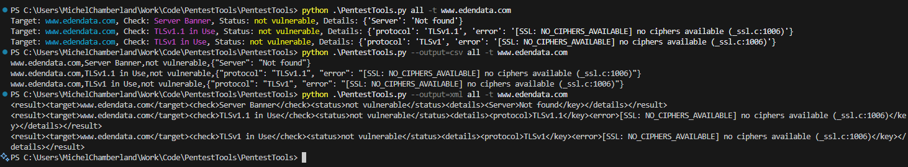

# PentestTools

A collection of scripts useful when pentesting

run "python PentestTools.py" for help

Add your own modules in PentestTools/modules

In that folder, you will also find the two following files:
- sample_module.py: a simple example module, suitable to be copied when starting a new module
- TLSv1_Test.py: an example completed module
- TLSv11_Test.py: an example completed module

To implement a module, you only need 2 functions
- parse_args: to parse command line arguments
- run: to run your check and create test results

Test Results should be put in a TestResult object. This object contains four properties:
- target: what target are we checking
- check: what check are we doing
- status: what is the status (vulnerable, not vulnerable, check failure)
- details: any additional details that might be useful in the output

